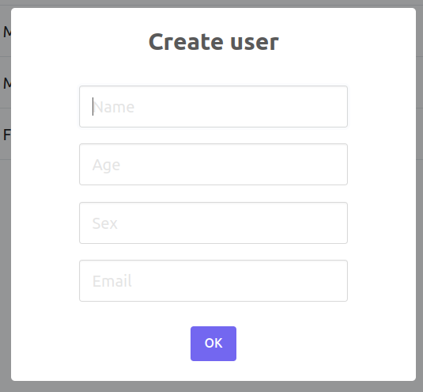
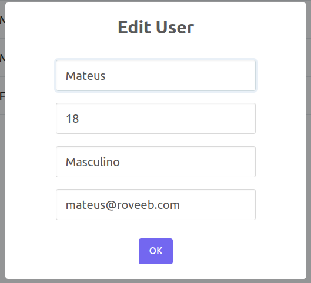

# CRUD com API + frontend

O exemplo presente nesse repositório contém um frontend que consome a [API criada em aula](https://github.com/christianbayer/crie_ti-cwia-t1/tree/main/aula9).

O consumo é feito através do AXIOS e o frontend possui algumas bibliotecas para deixar o visual mais agradável.


## Como executar

Para o projeto funcionar, a API deve ser iniciada e depois executado o frontend

### API

Acesse o diretório api

```
cd api
```

Crie o arquivo `.env` com base no `.env.example`
```
cp .env.example .env
```

Utilize o editor de sua preferência para preencher os valores das variáveis de ambiente

Instale os pacotes do NodeJS
```
npm install
```

Execute a API
```
npm run serve
```

### Frontend
No front, basta editar o arquivo `index.js`, na primeira linha, colocando o endpoint da sua API. No caso, está configurado para usar o `http://localhost:3000/`

```javascript
const ENDPOINT = "http://localhost:3000";
```

Abra o arquivo index.html e utilize.



# Publishers

# Publishers

# Publishers

# Publishers

# Publishers

# Publishers

# Publishers

# Publishers

